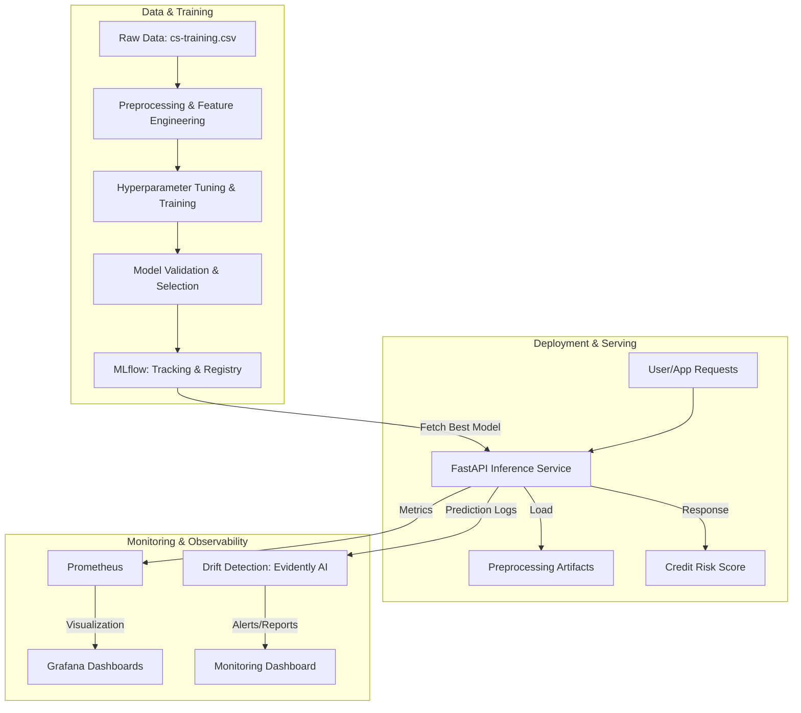

# 🛡️ mloops: End-to-End MLOps for Credit Risk Prediction

[](https://www.python.org/)
[](https://fastapi.tiangolo.com/)
[](https://mlflow.org/)
[](https://docs.docker.com/compose/)
[](https://docs.pytest.org/)

## 🌐 Live Demo

[Click here to view the deployed application](https://mlops-credit-risk-frontend.onrender.com/)

A production-ready, automated MLOps system for credit risk modeling. This project demonstrates the complete machine learning lifecycle, from data ingestion and feature engineering to automated training, model registry, real-time API serving, and continuous observability.

## 🎯 Business Value

Predicting credit risk allows financial institutions to minimize defaults and optimize lending decisions. This system ensures that models are not just accurate in research, but reliable, scalable, and monitorable in production environments.

## 🏗️ System Architecture



## 🛠️ Tech Stack

| Category | Tools |
| :--- | :--- |
| **Core Language** | Python 3.9+ |
| **Machine Learning** | XGBoost, Scikit-learn, Pandas, NumPy |
| **MLOps & Tracking** | MLflow |
| **Model Serving** | FastAPI, Uvicorn |
| **Containerization** | Docker, Docker Compose |
| **Observability** | Prometheus, Grafana, Evidently AI |
| **Testing** | Pytest, HTTPX |
| **CI/CD** | GitHub Actions |

## 📁 Project Structure

```text
mlops-credit-risk/
├── api/                # FastAPI inference service
├── artifacts/          # Locally stored model and preprocessing artifacts
├── data/                # Raw and processed datasets
├── docker/             # Docker configurations and orchestration
├── mlflow/             # MLflow tracking database and metadata
├── notebooks/          # Jupyter notebooks for EDA and experiments
├── scripts/            # Automation and bootstrap scripts
├── src/                # Core ML logic (preprocessing, training, monitoring)
├── tests/              # Automated unit and integration tests
├── requirements.txt   # Project dependencies
└── docker-compose.yml  # Full-stack deployment orchestration
```

## 🚀 Getting Started

### 1. Prerequisites
- Python 3.9+
- Docker & Docker Compose
- Git

### 2. Local Development Setup

```bash
# Clone the repository
git clone <repository-url>
cd mloops

# Create and activate a virtual environment
python -m venv venv
# On Windows:
.\venv\Scripts\activate
# On Linux/macOS:
source venv/bin/activate

# Install dependencies
pip install -r requirements.txt

# Set up environment variables
cp .env.example .env
# (Optional: Edit .env to customize ports and MLflow URI)

# Bootstrap: Run initial training and register the model
python scripts/bootstrap.py

# Start the API locally
uvicorn api.main:app --reload
```

### 3. Full Stack Deployment (Docker)
To launch the entire ecosystem (API, MLflow, Prometheus, Grafana, Frontend) in one command:

```bash
docker compose -f docker/docker-compose.yml up -d --build
```

## 🔄 Model Lifecycle & Deployment Workflow

1.  **Experimentation**: Data scientists use `notebooks/` to explore data and validate assumptions.
2.  **Automated Training**: Running `src/train.py` triggers the automated pipeline:
    *   **Preprocessing**: Cleaning and feature engineering via `src/preprocessing.py`.
    *   **Tuning**: Hyperparameter optimization for XGBoost using `RandomizedSearchCV`.
    *   **Evaluation**: Comparing candidates (e.g., Logistic Regression vs. XGBoost) against a validation set.
    *   **Registry**: The winner is logged to MLflow and registered as a new model version.
3.  **Deployment**: The `fastapi-app` service pulls the latest registered model and its corresponding preprocessing artifacts from MLflow.
4.  **Monitoring**: Real-time prediction metrics are scraped by Prometheus, while `src/monitor.py` uses Evidently AI to detect data drift and generate reports.

## 🔌 API Reference

The API is accessible at `http://localhost:8000`.

### Predict Credit Risk
`POST /predict`

**Example Request:**
```bash
curl -X 'POST' \
  'http://localhost:8000/predict' \
  -H 'Content-Type: application/json' \
  -d '{
  "RevolvingUtilizationOfUnsecuredLines": 0.32,
  "age": 45,
  "NumberOfTime30_59DaysPastDueNotWorse": 0,
  "DebtRatio": 0.15,
  "MonthlyIncome": 5000.0,
  "NumberOfOpenCreditLinesAndLoans": 12,
  "NumberOfTimes90DaysLate": 0,
  "NumberRealEstateLoansOrLines": 1,
  "NumberOfTime60_89DaysPastDueNotWorse": 0,
  "NumberOfDependents": 2
}'
```

**Example Response:**
```json
{
  "prediction": 0,
  "probability": 0.12,
  "model_version": "1",
  "status": "success"
}
```

## 🧪 Testing & Validation

The project maintains high code quality through automated testing:

- **Unit Tests**: `pytest` covers preprocessing logic and utility functions in `src/`.
- **Integration Tests**: `tests/test_api.py` ensures the API endpoints function correctly with real payloads.
- **Lifecycle Tests**: `tests/test_model_lifecycle.py` validates the end-to-end flow from training to registry.

Run tests with:
```bash
pytest
```

## 🛡️ Production Checklist
- [ ] **Security**: Implement OAuth2/JWT for API authentication.
- [ ] **Scaling**: Deploy API on Kubernetes (EKS/GKE) for auto-scaling.
- [ ] **CI/CD**: Enable GitHub Actions for automated testing and container image builds.
- [ ] **Secrets**: Move `.env` secrets to AWS Secrets Manager or HashiCorp Vault.

---
**Developed by Shayan Bhattacharjee**
