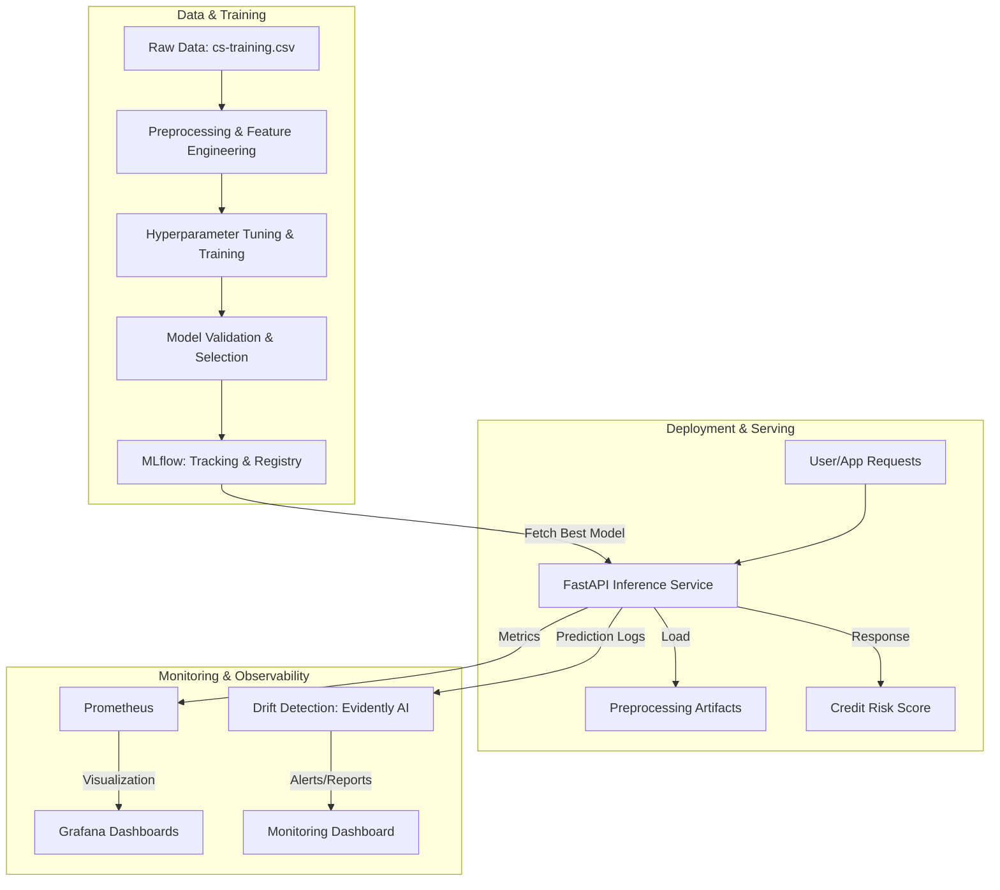

# 🛡️ End-to-End MLOps for Credit Risk Prediction

[](https://www.python.org/)
[](https://fastapi.tiangolo.com/)
[](https://mlflow.org/)
[](https://docs.docker.com/compose/)
[](https://docs.pytest.org/)

## 🌐 Live Demo

[Open the deployed credit risk application](https://mlops-credit-risk-frontend.onrender.com/)

A production-style MLOps system for credit risk prediction built around a deployed XGBoost champion model. The project demonstrates a complete machine learning lifecycle, from raw data ingestion and preprocessing to automated training, model registry governance, API serving, and deployment monitoring in a production-ready architecture.

## 🎯 Business Value

Predicting credit risk allows financial institutions to minimize defaults and optimize lending decisions. This system ensures that models are not just accurate in research, but reliable, scalable, and monitorable in production environments.

## 📊 Model Performance

The production credit-risk model is operating in the expected performance range for a risk-classification use case, with ROC-AUC close to the 0.85 benchmark referenced in the project workflow. Based on the current artifact metrics:

- Validation ROC-AUC: 0.8697
- Test ROC-AUC: 0.8628
- 5-fold cross-validation ROC-AUC mean: 0.8562
- Test average precision: 0.4006

This indicates strong discriminatory power for separating low- and high-risk applicants while remaining stable under cross-validation.

## 🏗️ System Architecture



## 🛠️ Tech Stack

| Category | Tools |
| :--- | :--- |
| **Core Language** | Python 3.9+ |
| **Machine Learning** | XGBoost, Scikit-learn, Pandas, NumPy |
| **MLOps & Tracking** | MLflow |
| **Model Serving** | FastAPI, Uvicorn |
| **Containerization** | Docker, Docker Compose |
| **Observability** | Prometheus, Grafana, Evidently AI |
| **Testing** | Pytest, HTTPX |
| **CI/CD** | GitHub Actions |

## 📁 Project Structure

```text
mlops-credit-risk/
├── api/                # FastAPI inference service
├── artifacts/          # Locally stored model and preprocessing artifacts
├── data/                # Raw and processed datasets
├── docker/             # Docker configurations and orchestration
├── mlflow/             # MLflow tracking database and metadata
├── notebooks/          # Jupyter notebooks for EDA and experiments
├── scripts/            # Automation and bootstrap scripts
├── src/                # Core ML logic (preprocessing, training, monitoring)
├── tests/              # Automated unit and integration tests
├── requirements.txt   # Project dependencies
└── docker-compose.yml  # Full-stack deployment orchestration
```

## 🚀 Getting Started

### 1. Prerequisites
- Python 3.9+
- Docker & Docker Compose
- Git

### 2. Local Development Setup

```bash
# Clone the repository
git clone https://github.com/bhattacharjeeshayan860-netizen/mlops-credit-risk.git
cd mlops-credit-risk

# Create and activate a virtual environment
python -m venv venv
# On Windows:
.\venv\Scripts\activate
# On Linux/macOS:
source venv/bin/activate

# Install dependencies
pip install -r requirements.txt

# Set up environment variables
cp .env.example .env
# (Optional: Edit .env to customize ports and MLflow URI)

# Bootstrap: Run initial training and register the model
python scripts/bootstrap.py

# Start the API locally
uvicorn api.main:app --reload
```

### 3. Full Stack Deployment (Docker)
To launch the entire ecosystem (API, MLflow, Prometheus, Grafana, Frontend) in one command:

```bash
docker compose -f docker/docker-compose.yml up -d --build
```

## 🔄 Model Lifecycle & Deployment Workflow

1. **Experimentation**: Data scientists use the `notebooks/` workspace to explore the credit dataset and validate assumptions before productionizing the pipeline.
2. **Automated Training**: Running `src/train.py` triggers the production-grade training workflow:
    * **Preprocessing**: Cleaning and feature engineering through `src/preprocessing.py`.
    * **Modeling**: XGBoost training with class imbalance handling and validation-aware tuning.
    * **Evaluation**: Candidate models are compared against the current champion using validation metrics and stability checks.
    * **Registry**: Winning models are logged to MLflow and promoted through a champion/challenger lifecycle.
3. **Deployment**: The deployed API loads the active champion model and preprocessing artifacts, serving real-time predictions through a containerized FastAPI service.
4. **Monitoring**: Prediction metrics are captured via Prometheus, while drift and model health checks are generated to support operational observability and retraining decisions.

## 🔌 API Reference

The API is accessible at `http://localhost:8000`.

### Predict Credit Risk
`POST /predict`

**Example Request:**
```bash
curl -X 'POST' \
  'http://localhost:8000/predict' \
  -H 'Content-Type: application/json' \
  -d '{
  "RevolvingUtilizationOfUnsecuredLines": 0.32,
  "age": 45,
  "NumberOfTime30_59DaysPastDueNotWorse": 0,
  "DebtRatio": 0.15,
  "MonthlyIncome": 5000.0,
  "NumberOfOpenCreditLinesAndLoans": 12,
  "NumberOfTimes90DaysLate": 0,
  "NumberRealEstateLoansOrLines": 1,
  "NumberOfTime60_89DaysPastDueNotWorse": 0,
  "NumberOfDependents": 2
}'
```

**Example Response:**
```json
{
  "prediction": 0,
  "probability": 0.12,
  "model_version": "1",
  "status": "success"
}
```

## 🧪 Testing & Validation

The project maintains high code quality through automated testing:

- **Unit Tests**: `pytest` covers preprocessing logic and utility functions in `src/`.
- **Integration Tests**: `tests/test_api.py` ensures the API endpoints function correctly with real payloads.
- **Lifecycle Tests**: `tests/test_model_lifecycle.py` validates the end-to-end flow from training to registry.

Run tests with:
```bash
pytest
```

## 🛡️ Production Checklist
- [ ] **Security**: Implement OAuth2/JWT for API authentication.
- [ ] **Scaling**: Deploy API on Kubernetes (EKS/GKE) for auto-scaling.
- [ ] **CI/CD**: Enable GitHub Actions for automated testing and container image builds.
- [ ] **Secrets**: Move `.env` secrets to AWS Secrets Manager or HashiCorp Vault.

---
**Developed by Shayan Bhattacharjee**
