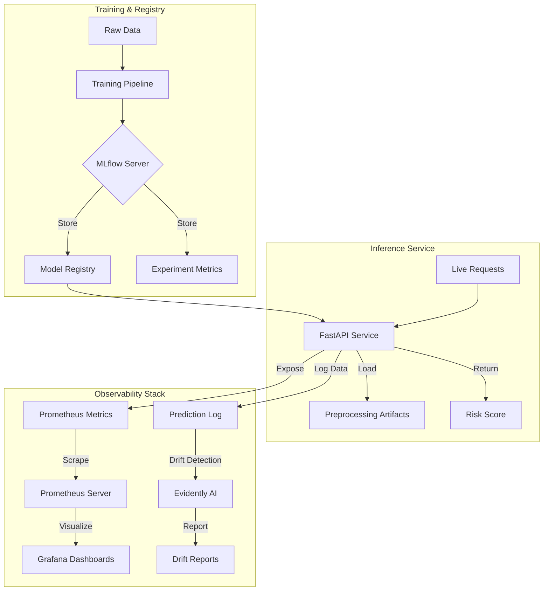

# mloops: End-to-End MLOps Pipeline for Credit Risk Modeling

[](https://www.python.org/)
[](https://fastapi.tiangolo.com/)
[](https://mlflow.org/)
[](https://docs.docker.com/compose/)

`mloops` is a production-oriented MLOps framework designed to manage the complete lifecycle of a credit-risk prediction model. It bridges the gap between experimental machine learning and reliable real-time serving by integrating experiment tracking, stateful preprocessing, automated observability, and containerized deployment.

---

## 🏗 Architecture

The system is composed of a modular stack designed for scalability and observability:



### Current Status

| Feature | Status |
| :--- | :--- |
| **ML Training Pipeline** | ✅ Implemented |
| **MLflow Tracking & Registry** | ✅ Implemented |
| **FastAPI Inference API** | ✅ Implemented |
| **Prometheus Metrics Integration** | ✅ Implemented |
| **Grafana Dashboard Support** | ✅ Implemented |
| **Evidently Drift Detection** | ✅ Implemented |
| **Dockerized Stack** | ✅ Implemented |
| **Frontend Dashboard** | ✅ Implemented |
| **Automated Retraining Loop** | ✅ Implemented |
| **Authentication & HTTPS** | ⏳ Planned |

---

## 🛠 Setup & Installation

### Prerequisites
- **Windows**: PowerShell 5.1+
- **Linux/macOS**: Bash
- **Docker & Docker Compose** installed and running

### Local Development

1. **Clone the repository**
   ```bash
   git clone <repository-url>
   cd mloops
   ```

2. **Set up a virtual environment**
   ```bash
   # Windows
   python -m venv venv
   .\venv\Scripts\activate

   # Linux/macOS
   python3 -m venv venv
   source venv/bin/activate
   ```

3. **Install dependencies**
   ```bash
   pip install -r requirements.txt
   ```

4. **Bootstrap the environment (First time only)**
   Ensure your `.env` is created and MLflow is running, then run:
   ```bash
   python scripts/bootstrap.py
   ```
   *This will train a baseline model and register it in MLflow.*

5. **Start the Inference API**
   ```bash
   uvicorn api.main:app --reload
   ```

6. **Run Tests**
   ```bash
   pytest
   ```

### Docker Compose (Full Stack)

Launch the entire MLOps stack (including Bootstrap, API, Frontend, MLflow, Prometheus, and Grafana) with one command:
```bash
docker compose -f docker/docker-compose.yml up -d --build
```
*The `bootstrap` service will automatically run first to ensure a model is available.*

---

## 🔌 API Reference

The inference service is available at `http://localhost:8000`.

### Endpoints

| Method | Endpoint | Purpose |
| :--- | :--- | :--- |
| `GET` | `/health` | Service health check. |
| `GET` | `/ready` | Readiness check (checks if model is loaded). |
| `POST` | `/predict` | Returns a credit-risk prediction and probability. |
| `GET` | `/model/info` | Returns metadata of the currently loaded model. |
| `GET` | `/reports/latest` | Returns the filename of the latest drift report. |
| `POST` | `/monitor` | Triggers a drift detection report. |
| `GET` | `/metrics` | Prometheus scrape endpoint for API metrics. |

### Example Request: `/predict`

**Payload:**
```json
{
  "RevolvingUtilizationOfUnsecuredLines": 0.32,
  "age": 45,
  "NumberOfTime30_59DaysPastDueNotWorse": 0,
  "DebtRatio": 0.15,
  "MonthlyIncome": 5000.0,
  "NumberOfOpenCreditLinesAndLoans": 12,
  "NumberOfTimes90DaysLate": 0,
  "NumberRealEstateLoansOrLines": 1,
  "NumberOfTime60_89DaysPastDueNotWorse": 0,
  "NumberOfDependents": 2
}
```

---

## ⚙️ Configuration

Create a `.env` file in the root directory.

**`.env.example` content:**
```env
# CORS Configuration (Comma-separated origins)
CORS_ORIGINS=http://localhost:5173,http://127.0.0.1:5173

# API Configuration
FASTAPI_PORT=8000

# MLflow Configuration
MLFLOW_TRACKING_URI=http://127.0.0.1:5000
MLFLOW_EXPERIMENT_NAME=credit_risk_model
MLFLOW_ARTIFACT_PATH=model
MLFLOW_PORT=5000

# Monitoring & Observability
PROMETHEUS_PORT=9090
GRAFANA_PORT=3000
GRAFANA_ADMIN_USER=admin
GRAFANA_ADMIN_PASSWORD=change-me
```

---

## 🐳 Docker Service Summary

| Service | Port | Description |
| :--- | :--- | :--- |
| `bootstrap` | N/A | One-shot service to train/register initial model |
| `fastapi-app` | `8000` | Real-time inference API |
| `frontend` | `80` | Production-ready web dashboard (Nginx) |
| `mlflow-server` | `5000` | Experiment tracking and registry |
| `prometheus` | `9090` | Metrics scraper |
| `grafana` | `3000` | Dashboard visualization |

---

## 🚀 Deployment Guide (Linux VPS)

To deploy this stack on a cloud instance:

1. **Clone and Configure**
   ```bash
   git clone <repository-url>
   cd mloops
   cp .env.example .env
   nano .env  # Update for production (e.g., change GRAFANA_ADMIN_PASSWORD, CORS_ORIGINS)
   ```

2. **Launch Stack**
   ```bash
   docker compose -f docker/docker-compose.yml up -d --build
   ```

   For a public HTTPS deployment, set `DOMAIN` to a DNS name pointing to the
   server, set strong `API_AUTH_TOKEN` and `GRAFANA_ADMIN_PASSWORD` values, and
   start the Caddy profile:
   ```bash
   docker compose --profile production -f docker/docker-compose.yml up -d --build
   ```
   Caddy obtains and renews the TLS certificate automatically. Open ports 80
   and 443 in the firewall; MLflow, Prometheus, and Grafana remain bound to
   localhost.

3. **Verify Health**
   ```bash
   docker compose -f docker/docker-compose.yml ps
   curl http://localhost:8000/health
   curl http://localhost/
   curl http://localhost:8000/ready
   ```

4. **Persistence & Storage**
   The following storage mechanisms are in place:
   - **MLflow database and artifacts**: Persisted through bind mounts.
   - **Grafana data**: Persisted through a named Docker volume (`grafana-data`).
   - **API artifacts & reports**: Persisted through bind mounts.

5. **Maintenance**
   - **View logs**: `docker compose -f docker/docker-compose.yml logs fastapi-app`
   - **Update deployment**: `docker compose -f docker/docker-compose.yml pull && docker compose -f docker/docker-compose.yml up -d`

---

## 🛡️ Production Checklist

- [ ] **HTTPS/TLS**: Use a reverse proxy (Nginx/Traefik) with Let's Encrypt.
- [ ] **Authentication**: Secure `/predict` and `/monitor` endpoints via reverse proxy auth.
- [ ] **CORS**: Restrict access to your specific frontend domain.
- [ ] **Rate Limiting**: Prevent API abuse.
- [ ] **Secret Management**: Use a secure vault instead of plain `.env` files.
- [ ] **Backups**: Schedule regular backups of MLflow and API artifact bind-mounted directories.
- [ ] **Drift Reporting**: Reports are served via `/api/reports/`. Ensure this path is secure.

---

## ❓ Troubleshooting

| Issue | Likely Cause | Solution |
| :--- | :--- | :--- |
| **MLflow connection failures** | `MLFLOW_TRACKING_URI` mismatch | Check `.env` and ensure `mlflow-server` is running |
| **Missing model artifacts** | Bootstrap failed or skipped | Check `docker compose logs bootstrap` |
| **API startup failures** | Port conflict or dependency error | Check `docker logs fastapi-app` |
| **Docker health-check fails** | Service taking too long to start | Increase `start_period` in `docker-compose.yml` |
| **Frontend cannot reach API** | `VITE_API_URL` or CORS mismatch | Check `.env` and Nginx configuration |

---

**Built by Shayan Bhattacharjee**
